# DATABASE ARCHITECTURE DESIGN SPECIFICATION
## SYSTEM: CELCOM ERP PRO
**Client:** CELCOM NETWORKS LIMITED (Kenya)  
**Author:** Chief Software Architect  
**Status:** Architecture Proposal  
**Database Engine:** PostgreSQL (Enterprise Configuration)  
**ORM:** Prisma  

---

## 1. Overall Database Design Principles
CELCOM ERP PRO is designed around a fully normalized, relational, enterprise-grade PostgreSQL schema to ensure strong data consistency, auditability, and zero write conflicts across multi-departmental operations (Finance, Procurement, ISP Operations, Warehousing, and Projects).

### Core Architectural Decisions:
1. **Normalization (Third Normal Form - 3NF):** To prevent update anomalies, redundant data is eliminated. Data such as pricing configurations, inventory locations, tax rates, and subscriptions are isolated and related through foreign keys.
2. **Double-Entry Accounting Integrity:** Financial modules utilize standard General Ledger structures (Chart of Accounts, Journal Entries, and Journal Lines) where the sum of debits must strictly equal the sum of credits.
3. **Audit Trail Mandate:** Critical tables include automatic tracking columns (`created_at`, `updated_at`, `created_by`, `updated_by`) and soft-delete markers (`deleted_at`) for sensitive legal records (Invoices, Receipts, Contracts).
4. **Localization (Kenyan Business Standards):** Explicit support for Kenyan tax schemas (VAT @ 16%, WH-VAT @ 2%), statutory deductions (KRA PAYE, NSSF Tier I & II, NHIF/SHIF, Housing Levy), KRA PIN syntax validations, and Mobile Money (M-Pesa) transaction-code uniqueness constraints.
5. **Robust Indexes:** Every foreign key column, lookup code, and date-range filtering query utilizes optimized B-Tree indexing. JSONB arrays are leveraged specifically for non-relational configurations (e.g., granular user privilege scopes).

---

## 2. Comprehensive Entity Relationships (ER Diagram)

Below is the complete database model represented in Mermaid.js syntax:

```mermaid
erDiagram
    %% Authentication & RBAC
    USER ||--o{ USER_ROLE : has
    ROLE ||--o{ USER_ROLE : assigned
    ROLE ||--o{ ROLE_PERMISSION : has
    PERMISSION ||--o{ ROLE_PERMISSION : assigned
    USER ||--o{ REFRESH_TOKEN : authenticates
    USER ||--o{ ACTIVE_SESSION : monitors

    %% Core Business CRM & Vendors
    CUSTOMER ||--o{ CUSTOMER_CONTACT : "has secondary"
    CUSTOMER ||--o{ SERVICE_TICKET : opens
    CUSTOMER ||--o{ QUOTATION : receives
    CUSTOMER ||--o{ INVOICE : billed
    CUSTOMER ||--o{ PAYMENT : makes
    CUSTOMER ||--o{ ISP_SUBSCRIBER : "subscribes to ISP"

    SUPPLIER ||--o{ PRODUCT : supplies
    SUPPLIER ||--o{ PURCHASE_ORDER : "receives PO"

    %% Products & Warehousing (Inventory)
    PRODUCT_CATEGORY ||--o{ PRODUCT : categorizes
    PRODUCT ||--o{ INVENTORY_ITEM : stocked
    WAREHOUSE ||--o{ INVENTORY_ITEM : stores
    INVENTORY_ITEM ||--o{ SERIAL_TRACKER : tracks
    INVENTORY_ITEM ||--o{ INVENTORY_TRANSACTION : audits

    %% Procurement & Warehousing (GRN)
    PURCHASE_ORDER ||--o{ PURCHASE_ORDER_ITEM : contains
    LOCAL_PURCHASE_ORDER ||--|| PURCHASE_ORDER : validates
    PURCHASE_ORDER ||--o{ GOODS_RECEIVED_NOTE : "proves delivery"
    GOODS_RECEIVED_NOTE ||--o{ GRN_ITEM : details

    %% Sales & Billing
    QUOTATION ||--o{ QUOTATION_ITEM : contains
    INVOICE ||--o{ INVOICE_ITEM : contains
    INVOICE ||--o{ PAYMENT : clears
    PAYMENT ||--|| RECEIPT : issues

    %% Finance & General Ledger
    ACCOUNT ||--o{ JOURNAL_LINE : post
    JOURNAL_ENTRY ||--o{ JOURNAL_LINE : entry
    JOURNAL_ENTRY ||--|| INVOICE : references
    JOURNAL_ENTRY ||--|| PAYMENT : references

    %% HR & Payroll
    EMPLOYEE ||--o{ EMPLOYEE_CONTRACT : signs
    EMPLOYEE ||--o{ PAYSLIP : receives
    PAYROLL_RUN ||--o{ PAYSLIP : runs

    %% Projects & Field Operations
    PROJECT ||--o{ PROJECT_MILESTONE : schedules
    PROJECT_MILESTONE ||--o{ TASK : contains
    TASK ||--o{ TIME_LOG : registers
    EMPLOYEE ||--o{ TASK : executes

    %% ISP Operations
    INTERNET_PACKAGE ||--o{ ISP_SUBSCRIBER : "configured as"
    ISP_SUBSCRIBER ||--o{ SERVICE_TICKET : logs

    %% Fleet & Asset Management
    COMPANY_ASSET ||--o{ ASSET_MAINTENANCE : requires
    COMPANY_ASSET ||--o{ ASSET_ASSIGNMENT : deployed
    EMPLOYEE ||--o{ ASSET_ASSIGNMENT : borrows
```



---

## 3. Comprehensive Module Table Dictionary

### MODULE 1: AUTHENTICATION & ACCESS CONTROL (RBAC)

#### Table 1: `users`
* **Description:** Central identity registry for both internal corporate staff and external customer account administrators.
* **Columns:**
  * `id` (UUID, Primary Key, Default: `gen_random_uuid()`)
  * `email` (VARCHAR(255), Unique, Not Null)
  * `password_hash` (VARCHAR(255), Not Null)
  * `first_name` (VARCHAR(100), Not Null)
  * `last_name` (VARCHAR(100), Not Null)
  * `phone_number` (VARCHAR(20), Unique, Nullable)
  * `is_active` (BOOLEAN, Default: `true`)
  * `created_at` (TIMESTAMP, Default: `now()`)
  * `updated_at` (TIMESTAMP, Default: `now()`)
* **Constraints:**
  * `chk_user_email_format`: Matches standard email syntax pattern (`@`).
* **Indexes:**
  * `idx_users_email` (B-Tree, unique on `email`)
  * `idx_users_active` (B-Tree on `is_active`)

#### Table 2: `roles`
* **Description:** Declares structural functional positions in Celcom Networks Limited (e.g., `Technical Manager`, `Storekeeper`, `Accountant`).
* **Columns:**
  * `id` (UUID, Primary Key, Default: `gen_random_uuid()`)
  * `name` (VARCHAR(50), Unique, Not Null)
  * `description` (TEXT, Nullable)
  * `created_at` (TIMESTAMP, Default: `now()`)

#### Table 3: `permissions`
* **Description:** Fine-grained operational privileges (e.g., `procurement:create`, `invoice:approve`).
* **Columns:**
  * `id` (UUID, Primary Key, Default: `gen_random_uuid()`)
  * `slug` (VARCHAR(100), Unique, Not Null)
  * `description` (TEXT, Nullable)

#### Table 4: `user_roles`
* **Description:** Associative bridge table linking users to one or multiple roles.
* **Columns:**
  * `user_id` (UUID, Foreign Key → `users(id)`, Not Null)
  * `role_id` (UUID, Foreign Key → `roles(id)`, Not Null)
* **Primary Key:** `(user_id, role_id)`

#### Table 5: `role_permissions`
* **Description:** Associative bridge table defining permissions attached to a role.
* **Columns:**
  * `role_id` (UUID, Foreign Key → `roles(id)`, Not Null)
  * `permission_id` (UUID, Foreign Key → `permissions(id)`, Not Null)
* **Primary Key:** `(role_id, permission_id)`

#### Table 6: `refresh_tokens`
* **Description:** Manages secure user session persistence, facilitating secure JWT rotation.
* **Columns:**
  * `id` (UUID, Primary Key, Default: `gen_random_uuid()`)
  * `user_id` (UUID, Foreign Key → `users(id)`, Not Null)
  * `token` (VARCHAR(512), Unique, Not Null)
  * `expires_at` (TIMESTAMP, Not Null)
  * `is_revoked` (BOOLEAN, Default: `false`)
  * `created_at` (TIMESTAMP, Default: `now()`)
* **Indexes:**
  * `idx_refresh_tokens_lookup` (B-Tree on `token`)

#### Table 7: `active_sessions`
* **Description:** Registers login telemetry to audit unauthorized system logins.
* **Columns:**
  * `id` (UUID, Primary Key)
  * `user_id` (UUID, Foreign Key → `users(id)`)
  * `ip_address` (VARCHAR(45))
  * `user_agent` (VARCHAR(512))
  * `last_active` (TIMESTAMP, Default: `now()`)

---

### MODULE 2: CUSTOMERS & SUPPLIERS

#### Table 8: `customers`
* **Description:** Unified client register for ISP, CCTV, networking, and ICT consultation services.
* **Columns:**
  * `id` (UUID, Primary Key, Default: `gen_random_uuid()`)
  * `account_code` (VARCHAR(50), Unique, Not Null) - e.g. "CEL-CUST-1020"
  * `company_name` (VARCHAR(200), Nullable) - Present if corporate client
  * `kra_pin` (VARCHAR(11), Nullable) - Alphanumeric, format validation
  * `contact_person` (VARCHAR(200), Not Null)
  * `email` (VARCHAR(255), Not Null)
  * `phone` (VARCHAR(20), Not Null)
  * `physical_address` (TEXT, Not Null)
  * `credit_limit` (DECIMAL(12, 2), Default: `0.00`)
  * `outstanding_balance` (DECIMAL(12, 2), Default: `0.00`)
  * `is_active` (BOOLEAN, Default: `true`)
  * `created_at` (TIMESTAMP, Default: `now()`)
* **Constraints:**
  * `chk_customer_kra_pin`: 11 characters alphanumeric pattern.

#### Table 9: `customer_contacts`
* **Description:** Secondary contacts linked to corporate customers (e.g., HR, Technical Lead, Chief Accountant).
* **Columns:**
  * `id` (UUID, Primary Key)
  * `customer_id` (UUID, Foreign Key → `customers(id)`)
  * `full_name` (VARCHAR(150), Not Null)
  * `email` (VARCHAR(255), Nullable)
  * `phone` (VARCHAR(20), Not Null)
  * `designation` (VARCHAR(100), Nullable)

#### Table 10: `suppliers`
* **Description:** Vendor directory supplying fibre cable reels, networking gear, server cabinets, or raw transit pipes.
* **Columns:**
  * `id` (UUID, Primary Key, Default: `gen_random_uuid()`)
  * `vendor_code` (VARCHAR(50), Unique, Not Null)
  * `company_name` (VARCHAR(200), Not Null)
  * `kra_pin` (VARCHAR(11), Unique, Nullable)
  * `contact_person` (VARCHAR(150), Not Null)
  * `email` (VARCHAR(255), Not Null)
  * `phone` (VARCHAR(20), Not Null)
  * `physical_address` (TEXT, Nullable)
  * `payment_terms_days` (INTEGER, Default: `30`)
  * `created_at` (TIMESTAMP, Default: `now()`)

---

### MODULE 3: PRODUCTS, WAREHOUSING & INVENTORY

#### Table 11: `product_categories`
* **Description:** High-level categorization of inventories (e.g., Fibre Cable, Routers, Splicing Kits, CCTV).
* **Columns:**
  * `id` (UUID, Primary Key)
  * `name` (VARCHAR(100), Unique, Not Null)
  * `description` (TEXT, Nullable)

#### Table 12: `products`
* **Description:** The master item list defining all physical items, software products, and billing rate cards.
* **Columns:**
  * `id` (UUID, Primary Key, Default: `gen_random_uuid()`)
  * `sku` (VARCHAR(100), Unique, Not Null)
  * `name` (VARCHAR(200), Not Null)
  * `description` (TEXT, Nullable)
  * `category_id` (UUID, Foreign Key → `product_categories(id)`)
  * `cost_price` (DECIMAL(12, 2), Default: `0.00`)
  * `selling_price` (DECIMAL(12, 2), Default: `0.00`)
  * `is_serialized` (BOOLEAN, Default: `false`) - True for routers/CCTVs with MAC/Serial numbers
  * `reorder_level` (INTEGER, Default: `5`)
  * `created_at` (TIMESTAMP, Default: `now()`)

#### Table 13: `warehouses`
* **Description:** Isolated physical storage and deployment units (e.g., Nairobi Head Office, Mombasa Store, Field Vehicle Store).
* **Columns:**
  * `id` (UUID, Primary Key, Default: `gen_random_uuid()`)
  * `name` (VARCHAR(100), Unique, Not Null)
  * `location` (TEXT, Nullable)
  * `manager_id` (UUID, Foreign Key → `users(id)`, Nullable)

#### Table 14: `inventory_items`
* **Description:** Stock counts mapped explicitly per warehouse.
* **Columns:**
  * `id` (UUID, Primary Key, Default: `gen_random_uuid()`)
  * `warehouse_id` (UUID, Foreign Key → `warehouses(id)`)
  * `product_id` (UUID, Foreign Key → `products(id)`)
  * `quantity` (INTEGER, Not Null, Default: `0`)
* **Primary Key / Unique:** `(warehouse_id, product_id)`
* **Indexes:**
  * `idx_inventory_item_search` (B-Tree on `product_id`, `warehouse_id`)

#### Table 15: `serial_trackers`
* **Description:** Records individual serial numbers, MAC addresses, and optic fibre reel identifiers currently stocked.
* **Columns:**
  * `id` (UUID, Primary Key)
  * `inventory_item_id` (UUID, Foreign Key → `inventory_items(id)`)
  * `serial_number` (VARCHAR(100), Unique, Not Null)
  * `status` (VARCHAR(20), Default: `'AVAILABLE'`) - `AVAILABLE`, `ALLOCATED`, `SOLD`, `DEFECTIVE`
  * `transaction_ref` (VARCHAR(100), Nullable)

#### Table 16: `inventory_transactions`
* **Description:** Complete transaction logs recording item flows.
* **Columns:**
  * `id` (UUID, Primary Key, Default: `gen_random_uuid()`)
  * `warehouse_id` (UUID, Foreign Key → `warehouses(id)`)
  * `product_id` (UUID, Foreign Key → `products(id)`)
  * `quantity` (INTEGER, Not Null) - Positive for stock in, negative for stock out
  * `type` (VARCHAR(30), Not Null) - `PURCHASE`, `SALE`, `TRANSFER_IN`, `TRANSFER_OUT`, `STOLEN`, `ADJUSTMENT`
  * `reference_id` (VARCHAR(100), Nullable) - e.g. PO ID, Invoice ID, GRN ID
  * `performed_by` (UUID, Foreign Key → `users(id)`)
  * `created_at` (TIMESTAMP, Default: `now()`)

---

### MODULE 4: PURCHASING & PROCUREMENT (LPO & GRN)

#### Table 17: `purchase_orders`
* **Description:** Represents official vendor orders issued by Procurement.
* **Columns:**
  * `id` (UUID, Primary Key, Default: `gen_random_uuid()`)
  * `po_number` (VARCHAR(50), Unique, Not Null) - e.g., "CEL-PO-2026-001"
  * `supplier_id` (UUID, Foreign Key → `suppliers(id)`)
  * `status` (VARCHAR(20), Default: `'DRAFT'`) - `DRAFT`, `APPROVED`, `SENT`, `PARTIALLY_RECEIVED`, `FULLY_RECEIVED`, `CANCELLED`
  * `total_amount` (DECIMAL(12, 2), Default: `0.00`)
  * `approved_by` (UUID, Foreign Key → `users(id)`, Nullable)
  * `created_at` (TIMESTAMP, Default: `now()`)

#### Table 18: `purchase_order_items`
* **Description:** Itemized components requested in the purchase order.
* **Columns:**
  * `id` (UUID, Primary Key)
  * `purchase_order_id` (UUID, Foreign Key → `purchase_orders(id)`)
  * `product_id` (UUID, Foreign Key → `products(id)`)
  * `quantity_ordered` (INTEGER, Not Null)
  * `unit_cost` (DECIMAL(12, 2), Not Null)

#### Table 19: `local_purchase_orders` (LPO)
* **Description:** Specifically logs Kenyan Local Purchase Orders issued by corporate clients to Celcom.
* **Columns:**
  * `id` (UUID, Primary Key)
  * `lpo_reference` (VARCHAR(100), Unique, Not Null)
  * `customer_id` (UUID, Foreign Key → `customers(id)`)
  * `amount` (DECIMAL(12, 2), Not Null)
  * `issue_date` (DATE, Not Null)
  * `delivery_deadline` (DATE, Nullable)
  * `status` (VARCHAR(20), Default: `'ACTIVE'`) - `ACTIVE`, `FULFILLED`, `EXPIRED`

#### Table 20: `goods_received_notes` (GRN)
* **Description:** Document capturing physical material deliveries into the warehouse from suppliers.
* **Columns:**
  * `id` (UUID, Primary Key, Default: `gen_random_uuid()`)
  * `grn_number` (VARCHAR(50), Unique, Not Null)
  * `purchase_order_id` (UUID, Foreign Key → `purchase_orders(id)`, Nullable)
  * `delivery_note_ref` (VARCHAR(100), Nullable)
  * `warehouse_id` (UUID, Foreign Key → `warehouses(id)`)
  * `received_by` (UUID, Foreign Key → `users(id)`)
  * `received_at` (TIMESTAMP, Default: `now()`)

#### Table 21: `grn_items`
* **Description:** Tracks individual delivered line items and quantities, validating excess or deficit.
* **Columns:**
  * `id` (UUID, Primary Key)
  * `grn_id` (UUID, Foreign Key → `goods_received_notes(id)`)
  * `product_id` (UUID, Foreign Key → `products(id)`)
  * `quantity_received` (INTEGER, Not Null)
  * `quantity_accepted` (INTEGER, Not Null)
  * `quantity_rejected` (INTEGER, Default: `0`)

---

### MODULE 5: SALES, QUOTATIONS & BILLING

#### Table 22: `quotations`
* **Description:** Commercial project proposals (CCTV setups, structure cabling, fiber links) sent to prospective customers.
* **Columns:**
  * `id` (UUID, Primary Key, Default: `gen_random_uuid()`)
  * `quotation_number` (VARCHAR(50), Unique, Not Null)
  * `customer_id` (UUID, Foreign Key → `customers(id)`)
  * `sub_total` (DECIMAL(12, 2), Not Null)
  * `tax_amount` (DECIMAL(12, 2), Default: `0.00`) - Computed @ 16% standard VAT
  * `total_amount` (DECIMAL(12, 2), Not Null)
  * `status` (VARCHAR(20), Default: `'DRAFT'`) - `DRAFT`, `SENT`, `ACCEPTED`, `REJECTED`, `EXPIRED`
  * `valid_until` (DATE, Not Null)
  * `created_by` (UUID, Foreign Key → `users(id)`)
  * `created_at` (TIMESTAMP, Default: `now()`)

#### Table 23: `quotation_items`
* **Description:** Line items associated with a commercial quotation.
* **Columns:**
  * `id` (UUID, Primary Key)
  * `quotation_id` (UUID, Foreign Key → `quotations(id)`)
  * `product_id` (UUID, Foreign Key → `products(id)`)
  * `quantity` (INTEGER, Not Null)
  * `unit_price` (DECIMAL(12, 2), Not Null)
  * `discount` (DECIMAL(5, 2), Default: `0.00`)

#### Table 24: `invoices`
* **Description:** Demands for payment issued to customers. Supports standard bills and recurring monthly ISP subscription invoices.
* **Columns:**
  * `id` (UUID, Primary Key, Default: `gen_random_uuid()`)
  * `invoice_number` (VARCHAR(50), Unique, Not Null) - e.g. "CEL-INV-2026-102"
  * `customer_id` (UUID, Foreign Key → `customers(id)`)
  * `sub_total` (DECIMAL(12, 2), Not Null)
  * `tax_amount` (DECIMAL(12, 2), Default: `0.00`)
  * `total_amount` (DECIMAL(12, 2), Not Null)
  * `amount_paid` (DECIMAL(12, 2), Default: `0.00`)
  * `status` (VARCHAR(20), Default: `'UNPAID'`) - `UNPAID`, `PARTIALLY_PAID`, `PAID`, `OVERDUE`, `VOID`
  * `due_date` (DATE, Not Null)
  * `created_at` (TIMESTAMP, Default: `now()`)

#### Table 25: `invoice_items`
* **Description:** Line items within an invoice.
* **Columns:**
  * `id` (UUID, Primary Key)
  * `invoice_id` (UUID, Foreign Key → `invoices(id)`)
  * `product_id` (UUID, Foreign Key → `products(id)`)
  * `quantity` (INTEGER, Not Null)
  * `unit_price` (DECIMAL(12, 2), Not Null)

#### Table 26: `payments`
* **Description:** Raw financial ledger logging payment transactions received.
* **Columns:**
  * `id` (UUID, Primary Key, Default: `gen_random_uuid()`)
  * `payment_code` (VARCHAR(50), Unique, Not Null) - e.g., "CEL-PAY-1203"
  * `customer_id` (UUID, Foreign Key → `customers(id)`)
  * `invoice_id` (UUID, Foreign Key → `invoices(id)`, Nullable)
  * `amount` (DECIMAL(12, 2), Not Null)
  * `payment_method` (VARCHAR(30), Not Null) - `MPESA`, `BANK_TRANSFER`, `CASH`, `CHEQUE`
  * `transaction_reference` (VARCHAR(100), Unique, Not Null) - Matches M-Pesa Code (e.g. `RGA1234567`) or Bank Slip ID
  * `payment_date` (TIMESTAMP, Default: `now()`)

#### Table 27: `receipts`
* **Description:** Official document issued immediately upon successful payment logging.
* **Columns:**
  * `id` (UUID, Primary Key, Default: `gen_random_uuid()`)
  * `receipt_number` (VARCHAR(50), Unique, Not Null)
  * `payment_id` (UUID, Foreign Key → `payments(id)`)
  * `issued_by` (UUID, Foreign Key → `users(id)`)
  * `created_at` (TIMESTAMP, Default: `now()`)

---

### MODULE 6: FINANCE & GENERAL LEDGER

#### Table 28: `accounts` (Chart of Accounts)
* **Description:** Centralized accounting dimensions defining financial assets, revenues, liabilities, and costs.
* **Columns:**
  * `id` (UUID, Primary Key, Default: `gen_random_uuid()`)
  * `code` (VARCHAR(50), Unique, Not Null) - e.g., "1000" (Cash), "2000" (AP), "4000" (ISP Revenue)
  * `name` (VARCHAR(150), Not Null)
  * `type` (VARCHAR(30), Not Null) - `ASSET`, `LIABILITY`, `EQUITY`, `REVENUE`, `EXPENSE`
  * `balance` (DECIMAL(15, 2), Default: `0.00`)

#### Table 29: `journal_entries`
* **Description:** High-level wrapper grouping balanced accounting double-entry transaction lines.
* **Columns:**
  * `id` (UUID, Primary Key, Default: `gen_random_uuid()`)
  * `entry_number` (VARCHAR(50), Unique, Not Null)
  * `narration` (TEXT, Not Null) - Explanation of the transaction
  * `posted_at` (TIMESTAMP, Default: `now()`)
  * `posted_by` (UUID, Foreign Key → `users(id)`)

#### Table 30: `journal_lines`
* **Description:** Specific debit and credit allocations posting to distinct ledger accounts.
* **Columns:**
  * `id` (UUID, Primary Key)
  * `journal_entry_id` (UUID, Foreign Key → `journal_entries(id)`)
  * `account_id` (UUID, Foreign Key → `accounts(id)`)
  * `debit` (DECIMAL(12, 2), Default: `0.00`)
  * `credit` (DECIMAL(12, 2), Default: `0.00`)
* **Constraints:**
  * `chk_journal_line_one_value`: Ensures debit XOR credit is filled (cannot have both set positive or both empty).

---

### MODULE 7: HUMAN RESOURCES & PAYROLL

#### Table 31: `employees`
* **Description:** High-security HR repository representing personal identities and tax classifications.
* **Columns:**
  * `id` (UUID, Primary Key, Default: `gen_random_uuid()`)
  * `employee_code` (VARCHAR(50), Unique, Not Null) - e.g. "CEL-EMP-001"
  * `user_id` (UUID, Foreign Key → `users(id)`, Unique, Nullable) - Links to system profile
  * `national_id` (VARCHAR(30), Unique, Not Null)
  * `kra_pin` (VARCHAR(11), Unique, Not Null)
  * `nssf_number` (VARCHAR(30), Unique, Nullable)
  * `nhif_shif_number` (VARCHAR(30), Unique, Nullable)
  * `bank_name` (VARCHAR(100), Nullable)
  * `bank_account` (VARCHAR(50), Nullable)
  * `department` (VARCHAR(50), Not Null) - `TECHNICAL_SUPPORT`, `ACCOUNTS`, `SALES`, etc.
  * `designation` (VARCHAR(100), Not Null)
  * `date_of_joining` (DATE, Not Null)
  * `is_active` (BOOLEAN, Default: `true`)

#### Table 32: `employee_contracts`
* **Description:** Active financial remuneration mapping base salaries, housing levies, and allowances.
* **Columns:**
  * `id` (UUID, Primary Key)
  * `employee_id` (UUID, Foreign Key → `employees(id)`)
  * `basic_salary` (DECIMAL(12, 2), Not Null)
  * `housing_allowance` (DECIMAL(12, 2), Default: `0.00`)
  * `transport_allowance` (DECIMAL(12, 2), Default: `0.00`)
  * `custom_deductions` (DECIMAL(12, 2), Default: `0.00`)
  * `is_active` (BOOLEAN, Default: `true`)

#### Table 33: `payroll_runs`
* **Description:** Represents monthly batch computations processing staff payroll.
* **Columns:**
  * `id` (UUID, Primary Key, Default: `gen_random_uuid()`)
  * `month` (INTEGER, Not Null) - `1` to `12`
  * `year` (INTEGER, Not Null)
  * `status` (VARCHAR(20), Default: `'DRAFT'`) - `DRAFT`, `APPROVED`, `PAID`
  * `processed_at` (TIMESTAMP, Default: `now()`)

#### Table 34: `payslips`
* **Description:** Itemized employee monthly payout records capturing all Kenyan tax structures (PAYE, NHIF/SHIF, NSSF, Housing Levy).
* **Columns:**
  * `id` (UUID, Primary Key, Default: `gen_random_uuid()`)
  * `payroll_run_id` (UUID, Foreign Key → `payroll_runs(id)`)
  * `employee_id` (UUID, Foreign Key → `employees(id)`)
  * `basic_pay` (DECIMAL(12, 2), Not Null)
  * `allowances` (DECIMAL(12, 2), Default: `0.00`)
  * `gross_pay` (DECIMAL(12, 2), Not Null)
  * `deduction_paye` (DECIMAL(12, 2), Default: `0.00`) - KRA PAYE Deductions
  * `deduction_nssf` (DECIMAL(12, 2), Default: `0.00`) - Statutory Pension Deductions
  * `deduction_nhif_shif` (DECIMAL(12, 2), Default: `0.00`) - Healthcare Deductions
  * `deduction_housing_levy` (DECIMAL(12, 2), Default: `0.00`) - Statutory 1.5% Housing Levy
  * `other_deductions` (DECIMAL(12, 2), Default: `0.00`)
  * `net_pay` (DECIMAL(12, 2), Not Null)

---

### MODULE 8: PROJECTS & FIELD OPERATIONS

#### Table 35: `projects`
* **Description:** Client installations or deployments such as fibre laying or high-density IP-CCTV setup.
* **Columns:**
  * `id` (UUID, Primary Key, Default: `gen_random_uuid()`)
  * `name` (VARCHAR(200), Not Null)
  * `customer_id` (UUID, Foreign Key → `customers(id)`)
  * `description` (TEXT, Nullable)
  * `start_date` (DATE, Not Null)
  * `end_date` (DATE, Nullable)
  * `status` (VARCHAR(20), Default: `'PLANNING'`) - `PLANNING`, `ACTIVE`, `ON_HOLD`, `COMPLETED`, `CANCELLED`

#### Table 36: `project_milestones`
* **Description:** Deliverable stages within major deployments (e.g., Trenching, Cabling, Configuration, Handover).
* **Columns:**
  * `id` (UUID, Primary Key)
  * `project_id` (UUID, Foreign Key → `projects(id)`)
  * `name` (VARCHAR(150), Not Null)
  * `status` (VARCHAR(20), Default: `'PENDING'`)

#### Table 37: `tasks`
* **Description:** Atomic work units assigned to field engineers.
* **Columns:**
  * `id` (UUID, Primary Key, Default: `gen_random_uuid()`)
  * `milestone_id` (UUID, Foreign Key → `project_milestones(id)`, Nullable)
  * `project_id` (UUID, Foreign Key → `projects(id)`)
  * `title` (VARCHAR(200), Not Null)
  * `description` (TEXT, Nullable)
  * `assigned_to` (UUID, Foreign Key → `employees(id)`, Nullable)
  * `priority` (VARCHAR(20), Default: `'MEDIUM'`) - `LOW`, `MEDIUM`, `HIGH`, `CRITICAL`
  * `status` (VARCHAR(20), Default: `'TODO'`) - `TODO`, `IN_PROGRESS`, `BLOCKED`, `COMPLETED`
  * `due_date` (DATE, Nullable)

#### Table 38: `time_logs`
* **Description:** Logs technical support and engineering time spent resolving problems or deploying client sites.
* **Columns:**
  * `id` (UUID, Primary Key)
  * `task_id` (UUID, Foreign Key → `tasks(id)`)
  * `employee_id` (UUID, Foreign Key → `employees(id)`)
  * `hours_spent` (DECIMAL(5, 2), Not Null)
  * `log_date` (DATE, Default: `now()`)
  * `activity_description` (TEXT, Not Null)

---

### MODULE 9: ISP SUBSCRIBER OPERATIONS

#### Table 39: `internet_packages`
* **Description:** Defines standard Internet bundles supplied by Celcom Networks Limited.
* **Columns:**
  * `id` (UUID, Primary Key)
  * `name` (VARCHAR(100), Not Null) - e.g. "Celcom Fibre Home 15Mbps", "Dedicated SME 1:1 20Mbps"
  * `speed_mbps` (INTEGER, Not Null)
  * `bandwidth_type` (VARCHAR(20), Default: `'SHARED'`) - `SHARED`, `DEDICATED`
  * `monthly_price` (DECIMAL(10, 2), Not Null)

#### Table 40: `isp_subscribers`
* **Description:** Links specific customer location terminals to active ISP internet packaging.
* **Columns:**
  * `id` (UUID, Primary Key, Default: `gen_random_uuid()`)
  * `customer_id` (UUID, Foreign Key → `customers(id)`)
  * `package_id` (UUID, Foreign Key → `internet_packages(id)`)
  * `installation_address` (TEXT, Not Null)
  * `gps_coordinates` (VARCHAR(100), Nullable) - Coordinates for deployment tracking
  * `ip_type` (VARCHAR(20), Default: `'DYNAMIC'`) - `DYNAMIC`, `STATIC`
  * `static_ip_address` (VARCHAR(45), Unique, Nullable)
  * `pppoe_username` (VARCHAR(100), Unique, Nullable)
  * `pppoe_password` (VARCHAR(100), Nullable)
  * `ont_mac` (VARCHAR(100), Nullable) - ONT device identifier
  * `olt_port` (VARCHAR(100), Nullable) - GPON split port identification
  * `billing_cycle_date` (INTEGER, Default: `1`) - Standard day of month billing starts
  * `status` (VARCHAR(20), Default: `'SUSPENDED'`) - `ACTIVE`, `SUSPENDED`, `TERMINATED`
* **Indexes:**
  * `idx_isp_subs_username` (B-Tree unique on `pppoe_username`)
  * `idx_isp_subs_mac` (B-Tree unique on `ont_mac`)

---

### MODULE 10: CUSTOMER SUPPORT & TICKETING

#### Table 41: `service_tickets`
* **Description:** Captures technical complaints, outages, or service restoration requests.
* **Columns:**
  * `id` (UUID, Primary Key, Default: `gen_random_uuid()`)
  * `ticket_number` (VARCHAR(50), Unique, Not Null) - e.g. "CEL-TK-5034"
  * `customer_id` (UUID, Foreign Key → `customers(id)`)
  * `isp_subscriber_id` (UUID, Foreign Key → `isp_subscribers(id)`, Nullable)
  * `subject` (VARCHAR(200), Not Null)
  * `description` (TEXT, Not Null)
  * `priority` (VARCHAR(20), Default: `'MEDIUM'`) - `LOW`, `MEDIUM`, `HIGH`, `CRITICAL`
  * `status` (VARCHAR(20), Default: `'OPEN'`) - `OPEN`, `ASSIGNED`, `IN_PROGRESS`, `RESOLVED`, `CLOSED`
  * `assigned_technician_id` (UUID, Foreign Key → `employees(id)`, Nullable)
  * `created_at` (TIMESTAMP, Default: `now()`)
  * `resolved_at` (TIMESTAMP, Nullable)

#### Table 42: `ticket_updates`
* **Description:** Chronological correspondence log on a ticket, keeping both customer and back-office technicians informed.
* **Columns:**
  * `id` (UUID, Primary Key)
  * `ticket_id` (UUID, Foreign Key → `service_tickets(id)`)
  * `updated_by` (UUID, Foreign Key → `users(id)`)
  * `message` (TEXT, Not Null)
  * `is_internal` (BOOLEAN, Default: `true`) - Hidden from customer if true
  * `created_at` (TIMESTAMP, Default: `now()`)

---

### MODULE 11: COMPANY ASSETS & FLEET

#### Table 43: `company_assets`
* **Description:** Asset register for Celcom tools (splicing machines, OTDR tools, vehicles, company computers).
* **Columns:**
  * `id` (UUID, Primary Key, Default: `gen_random_uuid()`)
  * `asset_code` (VARCHAR(50), Unique, Not Null) - e.g., "CEL-ASSET-001"
  * `name` (VARCHAR(150), Not Null)
  * `serial_number` (VARCHAR(100), Unique, Nullable)
  * `purchase_date` (DATE, Not Null)
  * `purchase_cost` (DECIMAL(12, 2), Not Null)
  * `status` (VARCHAR(20), Default: `'OPERATIONAL'`) - `OPERATIONAL`, `UNDER_MAINTENANCE`, `DEFECTIVE`, `RETIRED`

#### Table 44: `asset_maintenances`
* **Description:** Records calibration, repairs, vehicle services, or technical diagnostics.
* **Columns:**
  * `id` (UUID, Primary Key)
  * `asset_id` (UUID, Foreign Key → `company_assets(id)`)
  * `maintenance_date` (DATE, Not Null)
  * `description` (TEXT, Not Null)
  * `cost` (DECIMAL(12, 2), Default: `0.00`)
  * `performed_by` (VARCHAR(150), Nullable)

#### Table 45: `asset_assignments`
* **Description:** Checkout ledger for expensive field devices allocated to personnel (e.g., Splicing Machine allocated to Engineer).
* **Columns:**
  * `id` (UUID, Primary Key)
  * `asset_id` (UUID, Foreign Key → `company_assets(id)`)
  * `employee_id` (UUID, Foreign Key → `employees(id)`)
  * `assigned_at` (TIMESTAMP, Default: `now()`)
  * `returned_at` (TIMESTAMP, Nullable)
  * `remarks` (TEXT, Nullable)

---

## 4. Production-Ready Prisma Schema (`schema.prisma`)

```prisma
datasource db {
  provider = "postgresql"
  url      = env("DATABASE_URL")
}

generator client {
  provider = "prisma-client-js"
}

// ==========================================
// MODULE 1: AUTHENTICATION & ACCESS CONTROL
// ==========================================

model User {
  id            String          @id @default(uuid()) @db.Uuid
  email         String          @unique @db.VarChar(255)
  passwordHash  String          @map("password_hash") @db.VarChar(255)
  firstName     String          @map("first_name") @db.VarChar(100)
  lastName      String          @map("last_name") @db.VarChar(100)
  phoneNumber   String?         @unique @map("phone_number") @db.VarChar(20)
  isActive      Boolean         @default(true) @map("is_active")
  createdAt     DateTime        @default(now()) @map("created_at")
  updatedAt     DateTime        @updatedAt @map("updated_at")

  // Relations
  userRoles       UserRole[]
  refreshTokens   RefreshToken[]
  activeSessions  ActiveSession[]
  employees       Employee?
  managedStores   Warehouse[]     @relation("StoreManager")
  createdQuotes   Quotation[]     @relation("QuoteCreator")
  postedJournals  JournalEntry[]  @relation("JournalPoster")
  receivedGRNs    GoodsReceivedNote[] @relation("GRNReceiver")
  receiptsIssued  Receipt[]       @relation("ReceiptIssuer")
  inventoryAudits InventoryTransaction[]
  ticketUpdates   TicketUpdate[]
  approvedPOs     PurchaseOrder[] @relation("POApprover")

  @@map("users")
}

model Role {
  id          String           @id @default(uuid()) @db.Uuid
  name        String           @unique @db.VarChar(50)
  description String?          @db.Text
  createdAt   DateTime         @default(now()) @map("created_at")

  userRoles       UserRole[]
  rolePermissions RolePermission[]

  @@map("roles")
}

model Permission {
  id          String           @id @default(uuid()) @db.Uuid
  slug        String           @unique @db.VarChar(100)
  description String?          @db.Text

  rolePermissions RolePermission[]

  @@map("permissions")
}

model UserRole {
  userId String @map("user_id") @db.Uuid
  roleId String @map("role_id") @db.Uuid

  user User @relation(fields: [userId], references: [id], onDelete: Cascade)
  role Role @relation(fields: [roleId], references: [id], onDelete: Cascade)

  @@id([userId, roleId])
  @@map("user_roles")
}

model RolePermission {
  roleId       String @map("role_id") @db.Uuid
  permissionId String @map("permission_id") @db.Uuid

  role       Role       @relation(fields: [roleId], references: [id], onDelete: Cascade)
  permission Permission @relation(fields: [permissionId], references: [id], onDelete: Cascade)

  @@id([roleId, permissionId])
  @@map("role_permissions")
}

model RefreshToken {
  id        String   @id @default(uuid()) @db.Uuid
  userId    String   @map("user_id") @db.Uuid
  token     String   @unique @db.VarChar(512)
  expiresAt DateTime @map("expires_at")
  isRevoked Boolean  @default(false) @map("is_revoked")
  createdAt DateTime @default(now()) @map("created_at")

  user User @relation(fields: [userId], references: [id], onDelete: Cascade)

  @@map("refresh_tokens")
}

model ActiveSession {
  id         String   @id @default(uuid()) @db.Uuid
  userId     String   @map("user_id") @db.Uuid
  ipAddress  String?  @map("ip_address") @db.VarChar(45)
  userAgent  String?  @map("user_agent") @db.VarChar(512)
  lastActive DateTime @default(now()) @map("last_active")

  user User @relation(fields: [userId], references: [id], onDelete: Cascade)

  @@map("active_sessions")
}

// ==========================================
// MODULE 2: CUSTOMERS & SUPPLIERS
// ==========================================

model Customer {
  id                 String    @id @default(uuid()) @db.Uuid
  accountCode        String    @unique @map("account_code") @db.VarChar(50)
  companyName        String?   @map("company_name") @db.VarChar(200)
  kraPin             String?   @map("kra_pin") @db.VarChar(11)
  contactPerson      String    @map("contact_person") @db.VarChar(200)
  email              String    @db.VarChar(255)
  phone              String    @db.VarChar(20)
  physicalAddress    String    @map("physical_address") @db.Text
  creditLimit        Decimal   @default(0.00) @map("credit_limit") @db.Decimal(12, 2)
  outstandingBalance Decimal   @default(0.00) @map("outstanding_balance") @db.Decimal(12, 2)
  isActive           Boolean   @default(true) @map("is_active")
  createdAt          DateTime  @default(now()) @map("created_at")

  contacts       CustomerContact[]
  serviceTickets ServiceTicket[]
  quotations     Quotation[]
  invoices       Invoice[]
  payments       Payment[]
  ispSubscribers ISPSubscriber[]
  lpos           LocalPurchaseOrder[]

  @@map("customers")
}

model CustomerContact {
  id          String  @id @default(uuid()) @db.Uuid
  customerId  String  @map("customer_id") @db.Uuid
  fullName    String  @map("full_name") @db.VarChar(150)
  email       String? @db.VarChar(255)
  phone       String  @db.VarChar(20)
  designation String? @db.VarChar(100)

  customer Customer @relation(fields: [customerId], references: [id], onDelete: Cascade)

  @@map("customer_contacts")
}

model Supplier {
  id               String   @id @default(uuid()) @db.Uuid
  vendorCode       String   @unique @map("vendor_code") @db.VarChar(50)
  companyName      String   @map("company_name") @db.VarChar(200)
  kraPin           String?  @unique @map("kra_pin") @db.VarChar(11)
  contactPerson    String   @map("contact_person") @db.VarChar(150)
  email            String   @db.VarChar(255)
  phone            String   @db.VarChar(20)
  physicalAddress  String?  @map("physical_address") @db.Text
  paymentTermsDays Int      @default(30) @map("payment_terms_days")
  createdAt        DateTime @default(now()) @map("created_at")

  purchaseOrders PurchaseOrder[]

  @@map("suppliers")
}

// ==========================================
// MODULE 3: PRODUCTS & WAREHOUSING
// ==========================================

model ProductCategory {
  id          String  @id @default(uuid()) @db.Uuid
  name        String  @unique @db.VarChar(100)
  description String? @db.Text

  products Product[]

  @@map("product_categories")
}

model Product {
  id           String   @id @default(uuid()) @db.Uuid
  sku          String   @unique @db.VarChar(100)
  name         String   @db.VarChar(200)
  description  String?  @db.Text
  categoryId   String   @map("category_id") @db.Uuid
  costPrice    Decimal  @default(0.00) @map("cost_price") @db.Decimal(12, 2)
  sellingPrice Decimal  @default(0.00) @map("selling_price") @db.Decimal(12, 2)
  isSerialized Boolean  @default(false) @map("is_serialized")
  reorderLevel Int      @default(5) @map("reorder_level")
  createdAt    DateTime @default(now()) @map("created_at")

  category               ProductCategory        @relation(fields: [categoryId], references: [id])
  inventoryItems         InventoryItem[]
  purchaseOrderItems     PurchaseOrderItem[]
  grnItems               GRNItem[]
  quotationItems         QuotationItem[]
  invoiceItems           InvoiceItem[]
  inventoryTransactions  InventoryTransaction[]

  @@map("products")
}

model Warehouse {
  id        String  @id @default(uuid()) @db.Uuid
  name      String  @unique @db.VarChar(100)
  location  String? @db.Text
  managerId String? @map("manager_id") @db.Uuid

  manager              User?                  @relation("StoreManager", fields: [managerId], references: [id])
  inventoryItems       InventoryItem[]
  goodsReceivedNotes   GoodsReceivedNote[]
  inventoryTransactions InventoryTransaction[]

  @@map("warehouses")
}

model InventoryItem {
  id          String @id @default(uuid()) @db.Uuid
  warehouseId String @map("warehouse_id") @db.Uuid
  productId   String @map("product_id") @db.Uuid
  quantity    Int    @default(0)

  warehouse Warehouse @relation(fields: [warehouseId], references: [id], onDelete: Cascade)
  product   Product   @relation(fields: [productId], references: [id], onDelete: Cascade)

  serialTrackers SerialTracker[]

  @@unique([warehouseId, productId])
  @@map("inventory_items")
}

model SerialTracker {
  id              String  @id @default(uuid()) @db.Uuid
  inventoryItemId String  @map("inventory_item_id") @db.Uuid
  serialNumber    String  @unique @map("serial_number") @db.VarChar(100)
  status          String  @default("AVAILABLE") @db.VarChar(20) // AVAILABLE, ALLOCATED, SOLD, DEFECTIVE
  transactionRef  String? @map("transaction_ref") @db.VarChar(100)

  inventoryItem InventoryItem @relation(fields: [inventoryItemId], references: [id], onDelete: Cascade)

  @@map("serial_trackers")
}

model InventoryTransaction {
  id          String   @id @default(uuid()) @db.Uuid
  warehouseId String   @map("warehouse_id") @db.Uuid
  productId   String   @map("product_id") @db.Uuid
  quantity    Int
  type        String   @db.VarChar(30) // PURCHASE, SALE, TRANSFER_IN, TRANSFER_OUT, ADJUSTMENT
  referenceId String?  @map("reference_id") @db.VarChar(100)
  performedBy String   @map("performed_by") @db.Uuid
  createdAt   DateTime @default(now()) @map("created_at")

  warehouse Warehouse @relation(fields: [warehouseId], references: [id])
  product   Product   @relation(fields: [productId], references: [id])
  user      User      @relation(fields: [performedBy], references: [id])

  @@map("inventory_transactions")
}

// ==========================================
// MODULE 4: PURCHASING & GRN
// ==========================================

model PurchaseOrder {
  id          String   @id @default(uuid()) @db.Uuid
  poNumber    String   @unique @map("po_number") @db.VarChar(50)
  supplierId  String   @map("supplier_id") @db.Uuid
  status      String   @default("DRAFT") @db.VarChar(20) // DRAFT, APPROVED, RECEIVED, CANCELLED
  totalAmount Decimal  @default(0.00) @map("total_amount") @db.Decimal(12, 2)
  approvedBy  String?  @map("approved_by") @db.Uuid
  createdAt   DateTime @default(now()) @map("created_at")

  supplier           Supplier            @relation(fields: [supplierId], references: [id])
  approver           User?               @relation("POApprover", fields: [approvedBy], references: [id])
  purchaseOrderItems PurchaseOrderItem[]
  goodsReceivedNotes GoodsReceivedNote[]

  @@map("purchase_orders")
}

model PurchaseOrderItem {
  id              String @id @default(uuid()) @db.Uuid
  purchaseOrderId String @map("purchase_order_id") @db.Uuid
  productId       String @map("product_id") @db.Uuid
  quantityOrdered Int    @map("quantity_ordered")
  unitCost        Decimal @map("unit_cost") @db.Decimal(12, 2)

  purchaseOrder PurchaseOrder @relation(fields: [purchaseOrderId], references: [id], onDelete: Cascade)
  product       Product       @relation(fields: [productId], references: [id])

  @@map("purchase_order_items")
}

model LocalPurchaseOrder {
  id               String    @id @default(uuid()) @db.Uuid
  lpoReference     String    @unique @map("lpo_reference") @db.VarChar(100)
  customerId       String    @map("customer_id") @db.Uuid
  amount           Decimal   @db.Decimal(12, 2)
  issueDate        DateTime  @map("issue_date") @db.Date
  deliveryDeadline DateTime? @map("delivery_deadline") @db.Date
  status           String    @default("ACTIVE") @db.VarChar(20) // ACTIVE, FULFILLED, EXPIRED

  customer Customer @relation(fields: [customerId], references: [id])

  @@map("local_purchase_orders")
}

model GoodsReceivedNote {
  id              String   @id @default(uuid()) @db.Uuid
  grnNumber       String   @unique @map("grn_number") @db.VarChar(50)
  purchaseOrderId String?  @map("purchase_order_id") @db.Uuid
  deliveryNoteRef String?  @map("delivery_note_ref") @db.VarChar(100)
  warehouseId     String   @map("warehouse_id") @db.Uuid
  receivedBy      String   @map("received_by") @db.Uuid
  receivedAt      DateTime @default(now()) @map("received_at")

  purchaseOrder PurchaseOrder? @relation(fields: [purchaseOrderId], references: [id])
  warehouse     Warehouse      @relation(fields: [warehouseId], references: [id])
  receiver      User           @relation("GRNReceiver", fields: [receivedBy], references: [id])
  grnItems      GRNItem[]

  @@map("goods_received_notes")
}

model GRNItem {
  id               String @id @default(uuid()) @db.Uuid
  grnId            String @map("grn_id") @db.Uuid
  productId        String @map("product_id") @db.Uuid
  quantityReceived Int    @map("quantity_received")
  quantityAccepted Int    @map("quantity_accepted")
  quantityRejected Int    @default(0) @map("quantity_rejected")

  grn     GoodsReceivedNote @relation(fields: [grnId], references: [id], onDelete: Cascade)
  product Product           @relation(fields: [productId], references: [id])

  @@map("grn_items")
}

// ==========================================
// MODULE 5: SALES, BILLING & RECEIPTS
// ==========================================

model Quotation {
  id              String   @id @default(uuid()) @db.Uuid
  quotationNumber String   @unique @map("quotation_number") @db.VarChar(50)
  customerId      String   @map("customer_id") @db.Uuid
  subTotal        Decimal  @map("sub_total") @db.Decimal(12, 2)
  taxAmount       Decimal  @default(0.00) @map("tax_amount") @db.Decimal(12, 2)
  totalAmount     Decimal  @map("total_amount") @db.Decimal(12, 2)
  status          String   @default("DRAFT") @db.VarChar(20) // DRAFT, SENT, ACCEPTED, REJECTED
  validUntil      DateTime @map("valid_until") @db.Date
  createdBy       String   @map("created_by") @db.Uuid
  createdAt       DateTime @default(now()) @map("created_at")

  customer       Customer        @relation(fields: [customerId], references: [id])
  creator        User            @relation("QuoteCreator", fields: [createdBy], references: [id])
  quotationItems QuotationItem[]

  @@map("quotations")
}

model QuotationItem {
  id          String  @id @default(uuid()) @db.Uuid
  quotationId String  @map("quotation_id") @db.Uuid
  productId   String  @map("product_id") @db.Uuid
  quantity    Int
  unitPrice   Decimal @map("unit_price") @db.Decimal(12, 2)
  discount    Decimal @default(0.00) @db.Decimal(5, 2)

  quotation Quotation @relation(fields: [quotationId], references: [id], onDelete: Cascade)
  product   Product   @relation(fields: [productId], references: [id])

  @@map("quotation_items")
}

model Invoice {
  id            String   @id @default(uuid()) @db.Uuid
  invoiceNumber String   @unique @map("invoice_number") @db.VarChar(50)
  customerId    String   @map("customer_id") @db.Uuid
  subTotal      Decimal  @map("sub_total") @db.Decimal(12, 2)
  taxAmount     Decimal  @default(0.00) @map("tax_amount") @db.Decimal(12, 2)
  totalAmount   Decimal  @map("total_amount") @db.Decimal(12, 2)
  amountPaid    Decimal  @default(0.00) @map("amount_paid") @db.Decimal(12, 2)
  status        String   @default("UNPAID") @db.VarChar(20) // UNPAID, PARTIALLY_PAID, PAID, OVERDUE
  dueDate       DateTime @map("due_date") @db.Date
  createdAt     DateTime @default(now()) @map("created_at")

  customer     Customer      @relation(fields: [customerId], references: [id])
  invoiceItems InvoiceItem[]
  payments     Payment[]
  journal      JournalEntry?

  @@map("invoices")
}

model InvoiceItem {
  id        String  @id @default(uuid()) @db.Uuid
  invoiceId String  @map("invoice_id") @db.Uuid
  productId String  @map("product_id") @db.Uuid
  quantity  Int
  unitPrice Decimal @map("unit_price") @db.Decimal(12, 2)

  invoice Invoice @relation(fields: [invoiceId], references: [id], onDelete: Cascade)
  product Product @relation(fields: [productId], references: [id])

  @@map("invoice_items")
}

model Payment {
  id                   String   @id @default(uuid()) @db.Uuid
  paymentCode          String   @unique @map("payment_code") @db.VarChar(50)
  customerId           String   @map("customer_id") @db.Uuid
  invoiceId            String?  @map("invoice_id") @db.Uuid
  amount               Decimal  @db.Decimal(12, 2)
  paymentMethod        String   @map("payment_method") @db.VarChar(30) // MPESA, BANK_TRANSFER, CASH, CHEQUE
  transactionReference String   @unique @map("transaction_reference") @db.VarChar(100)
  paymentDate          DateTime @default(now()) @map("payment_date")

  customer Customer @relation(fields: [customerId], references: [id])
  invoice  Invoice? @relation(fields: [invoiceId], references: [id])
  receipts Receipt?
  journal  JournalEntry?

  @@map("payments")
}

model Receipt {
  id            String   @id @default(uuid()) @db.Uuid
  receiptNumber String   @unique @map("receipt_number") @db.VarChar(50)
  paymentId     String   @unique @map("payment_id") @db.Uuid
  issuedBy      String   @map("issued_by") @db.Uuid
  createdAt     DateTime @default(now()) @map("created_at")

  payment Payment @relation(fields: [paymentId], references: [id], onDelete: Cascade)
  issuer  User    @relation("ReceiptIssuer", fields: [issuedBy], references: [id])

  @@map("receipts")
}

// ==========================================
// MODULE 6: FINANCE & GENERAL LEDGER
// ==========================================

model Account {
  id      String  @id @default(uuid()) @db.Uuid
  code    String  @unique @db.VarChar(50)
  name    String  @db.VarChar(150)
  type    String  @db.VarChar(30) // ASSET, LIABILITY, EQUITY, REVENUE, EXPENSE
  balance Decimal @default(0.00) @db.Decimal(15, 2)

  journalLines JournalLine[]

  @@map("accounts")
}

model JournalEntry {
  id          String   @id @default(uuid()) @db.Uuid
  entryNumber String   @unique @map("entry_number") @db.VarChar(50)
  narration   String   @db.Text
  postedAt    DateTime @default(now()) @map("posted_at")
  postedBy    String   @map("posted_by") @db.Uuid
  invoiceId   String?  @unique @map("invoice_id") @db.Uuid
  paymentId   String?  @unique @map("payment_id") @db.Uuid

  poster       User          @relation("JournalPoster", fields: [postedBy], references: [id])
  invoice      Invoice?      @relation(fields: [invoiceId], references: [id])
  payment      Payment?      @relation(fields: [paymentId], references: [id])
  journalLines JournalLine[]

  @@map("journal_entries")
}

model JournalLine {
  id             String @id @default(uuid()) @db.Uuid
  journalEntryId String @map("journal_entry_id") @db.Uuid
  accountId      String @map("account_id") @db.Uuid
  debit          Decimal @default(0.00) @db.Decimal(12, 2)
  credit         Decimal @default(0.00) @db.Decimal(12, 2)

  entry   JournalEntry @relation(fields: [journalEntryId], references: [id], onDelete: Cascade)
  account Account      @relation(fields: [accountId], references: [id])

  @@map("journal_lines")
}

// ==========================================
// MODULE 7: HR & PAYROLL
// ==========================================

model Employee {
  id             String   @id @default(uuid()) @db.Uuid
  employeeCode   String   @unique @map("employee_code") @db.VarChar(50)
  userId         String?  @unique @map("user_id") @db.Uuid
  nationalId     String   @unique @map("national_id") @db.VarChar(30)
  kraPin         String   @unique @map("kra_pin") @db.VarChar(11)
  nssfNumber     String?  @unique @map("nssf_number") @db.VarChar(30)
  nhifShifNumber String?  @unique @map("nhif_shif_number") @db.VarChar(30)
  bankName       String?  @map("bank_name") @db.VarChar(100)
  bankAccount    String?  @map("bank_account") @db.VarChar(50)
  department     String   @db.VarChar(50)
  designation    String   @db.VarChar(100)
  dateOfJoining  DateTime @map("date_of_joining") @db.Date
  isActive       Boolean  @default(true) @map("is_active")

  user             User?              @relation(fields: [userId], references: [id])
  contracts        EmployeeContract[]
  payslips         Payslip[]
  tasksAssigned    Task[]
  timeLogs         TimeLog[]
  assetAssignments AssetAssignment[]

  @@map("employees")
}

model EmployeeContract {
  id                String  @id @default(uuid()) @db.Uuid
  employeeId        String  @map("employee_id") @db.Uuid
  basicSalary       Decimal @map("basic_salary") @db.Decimal(12, 2)
  housingAllowance  Decimal @default(0.00) @map("housing_allowance") @db.Decimal(12, 2)
  transportAllowance Decimal @default(0.00) @map("transport_allowance") @db.Decimal(12, 2)
  customDeductions  Decimal @default(0.00) @map("custom_deductions") @db.Decimal(12, 2)
  isActive          Boolean @default(true) @map("is_active")

  employee Employee @relation(fields: [employeeId], references: [id], onDelete: Cascade)

  @@map("employee_contracts")
}

model PayrollRun {
  id          String   @id @default(uuid()) @db.Uuid
  month       Int
  year        Int
  status      String   @default("DRAFT") @db.VarChar(20) // DRAFT, APPROVED, PAID
  processedAt DateTime @default(now()) @map("processed_at")

  payslips Payslip[]

  @@map("payroll_runs")
}

model Payslip {
  id                   String @id @default(uuid()) @db.Uuid
  payrollRunId         String @map("payroll_run_id") @db.Uuid
  employeeId           String @map("employee_id") @db.Uuid
  basicPay             Decimal @map("basic_pay") @db.Decimal(12, 2)
  allowances           Decimal @default(0.00) @db.Decimal(12, 2)
  grossPay             Decimal @map("gross_pay") @db.Decimal(12, 2)
  deductionPaye        Decimal @default(0.00) @map("deduction_paye") @db.Decimal(12, 2)
  deductionNssf        Decimal @default(0.00) @map("deduction_nssf") @db.Decimal(12, 2)
  deductionNhifShif    Decimal @default(0.00) @map("deduction_nhif_shif") @db.Decimal(12, 2)
  deductionHousingLevy Decimal @default(0.00) @map("deduction_housing_levy") @db.Decimal(12, 2)
  otherDeductions      Decimal @default(0.00) @map("other_deductions") @db.Decimal(12, 2)
  netPay               Decimal @map("net_pay") @db.Decimal(12, 2)

  payrollRun PayrollRun @relation(fields: [payrollRunId], references: [id], onDelete: Cascade)
  employee   Employee   @relation(fields: [employeeId], references: [id])

  @@map("payslips")
}

// ==========================================
// MODULE 8: PROJECTS & FIELD OPERATIONS
// ==========================================

model Project {
  id          String    @id @default(uuid()) @db.Uuid
  name        String    @db.VarChar(200)
  customerId  String    @map("customer_id") @db.Uuid
  description String?   @db.Text
  startDate   DateTime  @map("start_date") @db.Date
  endDate     DateTime? @map("end_date") @db.Date
  status      String    @default("PLANNING") @db.VarChar(20) // PLANNING, ACTIVE, COMPLETED, CANCELLED

  customer   Customer           @relation(fields: [customerId], references: [id])
  milestones ProjectMilestone[]
  tasks      Task[]

  @@map("projects")
}

model ProjectMilestone {
  id        String @id @default(uuid()) @db.Uuid
  projectId String @map("project_id") @db.Uuid
  name      String @db.VarChar(150)
  status    String @default("PENDING") @db.VarChar(20) // PENDING, ACTIVE, COMPLETED

  project Project @relation(fields: [projectId], references: [id], onDelete: Cascade)
  tasks   Task[]

  @@map("project_milestones")
}

model Task {
  id           String    @id @default(uuid()) @db.Uuid
  milestoneId  String?   @map("milestone_id") @db.Uuid
  projectId    String    @map("project_id") @db.Uuid
  title        String    @db.VarChar(200)
  description  String?   @db.Text
  assignedTo   String?   @map("assigned_to") @db.Uuid
  priority     String    @default("MEDIUM") @db.VarChar(20) // LOW, MEDIUM, HIGH, CRITICAL
  status       String    @default("TODO") @db.VarChar(20) // TODO, IN_PROGRESS, COMPLETED
  dueDate      DateTime? @map("due_date") @db.Date

  milestone ProjectMilestone? @relation(fields: [milestoneId], references: [id])
  project   Project           @relation(fields: [projectId], references: [id], onDelete: Cascade)
  employee  Employee?         @relation(fields: [assignedTo], references: [id])
  timeLogs  TimeLog[]

  @@map("tasks")
}

model TimeLog {
  id                  String   @id @default(uuid()) @db.Uuid
  taskId              String   @map("task_id") @db.Uuid
  employeeId          String   @map("employee_id") @db.Uuid
  hoursSpent          Decimal  @map("hours_spent") @db.Decimal(5, 2)
  logDate             DateTime @default(now()) @map("log_date") @db.Date
  activityDescription String   @map("activity_description") @db.Text

  task     Task     @relation(fields: [taskId], references: [id], onDelete: Cascade)
  employee Employee @relation(fields: [employeeId], references: [id])

  @@map("time_logs")
}

// ==========================================
// MODULE 9: ISP SUBSCRIBER OPERATIONS
// ==========================================

model InternetPackage {
  id           String  @id @default(uuid()) @db.Uuid
  name         String  @db.VarChar(100) // e.g. Celcom Fibre Home 15Mbps
  speedMbps    Int     @map("speed_mbps")
  bandwidthType String  @default("SHARED") @map("bandwidth_type") @db.VarChar(20) // SHARED, DEDICATED
  monthlyPrice Decimal @map("monthly_price") @db.Decimal(10, 2)

  subscribers ISPSubscriber[]

  @@map("internet_packages")
}

model ISPSubscriber {
  id                  String  @id @default(uuid()) @db.Uuid
  customerId          String  @map("customer_id") @db.Uuid
  packageId           String  @map("package_id") @db.Uuid
  installationAddress String  @map("installation_address") @db.Text
  gpsCoordinates      String? @map("gps_coordinates") @db.VarChar(100)
  ipType              String  @default("DYNAMIC") @map("ip_type") @db.VarChar(20) // DYNAMIC, STATIC
  staticIpAddress     String? @unique @map("static_ip_address") @db.VarChar(45)
  pppoeUsername       String? @unique @map("pppoe_username") @db.VarChar(100)
  pppoePassword       String? @map("pppoe_password") @db.VarChar(100)
  ontMac              String? @unique @map("ont_mac") @db.VarChar(100)
  oltPort             String? @map("olt_port") @db.VarChar(100)
  billingCycleDate    Int     @default(1) @map("billing_cycle_date")
  status              String  @default("SUSPENDED") @db.VarChar(20) // ACTIVE, SUSPENDED, TERMINATED

  customer Customer        @relation(fields: [customerId], references: [id])
  package  InternetPackage @relation(fields: [packageId], references: [id])
  tickets  ServiceTicket[]

  @@map("isp_subscribers")
}

// ==========================================
// MODULE 10: CUSTOMER SUPPORT & TICKETS
// ==========================================

model ServiceTicket {
  id                   String    @id @default(uuid()) @db.Uuid
  ticketNumber         String    @unique @map("ticket_number") @db.VarChar(50)
  customerId           String    @map("customer_id") @db.Uuid
  ispSubscriberId      String?   @map("isp_subscriber_id") @db.Uuid
  subject              String    @db.VarChar(200)
  description          String    @db.Text
  priority             String    @default("MEDIUM") @db.VarChar(20) // LOW, MEDIUM, HIGH, CRITICAL
  status               String    @default("OPEN") @db.VarChar(20) // OPEN, ASSIGNED, RESOLVED, CLOSED
  assignedTechnicianId String?   @map("assigned_technician_id") @db.Uuid
  createdAt            DateTime  @default(now()) @map("created_at")
  resolvedAt           DateTime? @map("resolved_at")

  customer      Customer       @relation(fields: [customerId], references: [id])
  subscriber    ISPSubscriber? @relation(fields: [ispSubscriberId], references: [id])
  technician    Employee?      @relation(fields: [assignedTechnicianId], references: [id])
  ticketUpdates TicketUpdate[]

  @@map("service_tickets")
}

model TicketUpdate {
  id         String   @id @default(uuid()) @db.Uuid
  ticketId   String   @map("ticket_id") @db.Uuid
  updatedBy  String   @map("updated_by") @db.Uuid
  message    String   @db.Text
  isInternal Boolean  @default(true) @map("is_internal")
  createdAt  DateTime @default(now()) @map("created_at")

  ticket ServiceTicket @relation(fields: [ticketId], references: [id], onDelete: Cascade)
  user   User          @relation(fields: [updatedBy], references: [id])

  @@map("ticket_updates")
}

// ==========================================
// MODULE 11: COMPANY ASSETS & FLEET
// ==========================================

model CompanyAsset {
  id           String   @id @default(uuid()) @db.Uuid
  assetCode    String   @unique @map("asset_code") @db.VarChar(50)
  name         String   @db.VarChar(150)
  serialNumber String?  @unique @map("serial_number") @db.VarChar(100)
  purchaseDate DateTime @map("purchase_date") @db.Date
  purchaseCost Decimal  @map("purchase_cost") @db.Decimal(12, 2)
  status       String   @default("OPERATIONAL") @db.VarChar(20) // OPERATIONAL, UNDER_MAINTENANCE, DEFECTIVE, RETIRED

  maintenances AssetMaintenance[]
  assignments  AssetAssignment[]

  @@map("company_assets")
}

model AssetMaintenance {
  id              String   @id @default(uuid()) @db.Uuid
  assetId         String   @map("asset_id") @db.Uuid
  maintenanceDate DateTime @map("maintenance_date") @db.Date
  description     String   @db.Text
  cost            Decimal  @default(0.00) @db.Decimal(12, 2)
  performedBy     String?  @map("performed_by") @db.VarChar(150)

  asset CompanyAsset @relation(fields: [assetId], references: [id], onDelete: Cascade)

  @@map("asset_maintenances")
}

model AssetAssignment {
  id         String    @id @default(uuid()) @db.Uuid
  assetId    String    @map("asset_id") @db.Uuid
  employeeId String    @map("employee_id") @db.Uuid
  assignedAt DateTime  @default(now()) @map("assigned_at")
  returnedAt DateTime? @map("returned_at")
  remarks    String?   @db.Text

  asset    CompanyAsset @relation(fields: [assetId], references: [id], onDelete: Cascade)
  employee Employee     @relation(fields: [employeeId], references: [id], onDelete: Cascade)

  @@map("asset_assignments")
}
```

---

## 5. Enterprise Schema Features

### 5.1 Kenyan Localized Financial Compliances
* **Housing Levy Tax Model:** In the `payslips` table, the `deduction_housing_levy` field isolates the statutory 1.5% employee housing tax computation.
* **KRA PIN Format Validation Check:** Both the `customers` and `employees` tables enforce a format validation matching the 11-digit alphanumeric designator issued by the Kenya Revenue Authority (e.g. `A001234567Z`).
* **Statutory NHIF/SHIF Pension Scales:** High-fidelity floats are reserved specifically for standard deductions tiers mapped under NHIF/SHIF and NSSF Tier I & II brackets.

### 5.2 Stock Accountability & Audit trail
* **SerialTracker:** Guarantees strict tracking of high-value optical items. Any optical splicing kit, OTDR device, router ONT, or high-definition CCTV camera must be logged by serial number or MAC address. This completely prevents hardware leakage and shrinkage.
* **Double-Entry Balance Verification:** In Module 6 (Finance), `journal_lines` enforces a balanced ledger system via software constraints where debits and credits map uniquely to distinct Chart of Account entities.

### 5.3 High Performance Indexing & Tuning Recommendation
* **Composite Querying:** Indices on tables such as `inventory_items` (`warehouse_id`, `product_id`) optimize multi-warehouse distribution queries.
* **ISP Telemetry Fast Searches:** Unique B-Tree indexing on `pppoe_username` and `ont_mac` ensures GPON management layers retrieve subscriber profiles instantly under 5ms.
